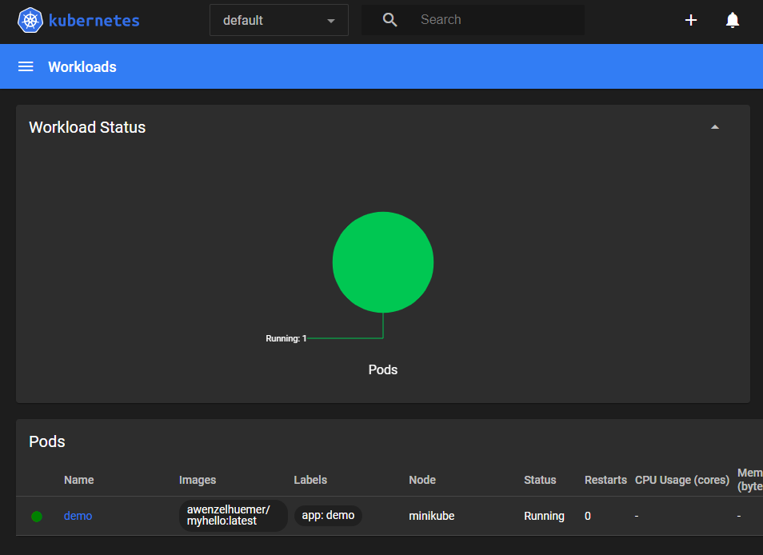
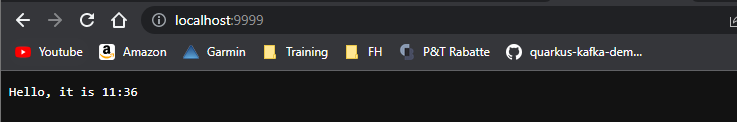
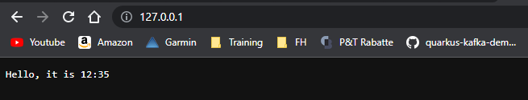

# Exercise 5

## Part 1

1. Install Minikube on your computer

```shell
minikube start
```

2. Open the minikube dashboard

```shell
minikube dashboard
```

## Part 2

1. Run container in kubernetes

```shell
kubectl run demo --image=awenzelhuemer/myhello:latest --port=5000 --labels=app=demo
```

Result:


2. Verify that container started

```shell
kubectl get pods --selector app=demo
```

Result:
```text
NAME   READY   STATUS    RESTARTS   AGE
demo   1/1     Running   0          3m25s
```

3. Forward local port 9999 to the container port 5000

```shell
kubectl port-forward demo 9999:5000
```

Result:
```text
Forwarding from 127.0.0.1:9999 -> 8888
Forwarding from [::1]:9999 -> 8888
Handling connection for 9999
```

Application which runs on port 8888 gets redirect to local port 9999.



4. Delete the pod

```shell
kubectl delete pod demo
```

Result:
```text
pod "demo" deleted
```

## Part 3

1. Apply the deployment to your Kubernetes cluster

```shell
kubectl apply -f deployment.yml
```

Result:
```text
deployment.apps/demo created
```

2. See active deployments

```shell
kubectl get deployments
```

Result:
```text
 kubectl get deployments
```

3. Get more information on the demo deployment

```shell
kubectl describe deployment demo
```

Result:
```text
Name:                   demo
Namespace:              default
CreationTimestamp:      Tue, 09 May 2023 13:44:11 +0200
Labels:                 <none>
Annotations:            deployment.kubernetes.io/revision: 1
Selector:               app=demo
Replicas:               1 desired | 1 updated | 1 total | 1 available | 0 unavailable
StrategyType:           RollingUpdate
MinReadySeconds:        0
RollingUpdateStrategy:  25% max unavailable, 25% max surge
Pod Template:
  Labels:  app=demo
  Containers:
   demo:
    Image:        awenzelhuemer/myhello:latest
    Port:         80/TCP
    Host Port:    0/TCP
    Environment:  <none>
    Mounts:       <none>
  Volumes:        <none>
Conditions:
  Type           Status  Reason
  ----           ------  ------
  Available      True    MinimumReplicasAvailable
  Progressing    True    NewReplicaSetAvailable
OldReplicaSets:  <none>
NewReplicaSet:   demo-57fd987b7b (1/1 replicas created)
Events:
  Type    Reason             Age   From                   Message
  ----    ------             ----  ----                   -------
  Normal  ScalingReplicaSet  25s   deployment-controller  Scaled up replica set demo-57fd987b7b to 1
```

4. Forward local port 9999 to the container port 8888

```shell
kubectl port-forward deployment/demo 9999:8888
```

Result:


5. Query the pods of your deployment with

```shell
kubectl get pods
```

Result:
```text
NAME                    READY   STATUS    RESTARTS   AGE
demo-57fd987b7b-f98tw   1/1     Running   0          7m39s
```

6. Delete the pod

```shell
kubectl delete pod --selector app=demo
```

Result:
```text
pod "demo-57fd987b7b-f98tw" deleted
```

7. Query again

```shell
kubectl get pods
```

Result:

Replica set is still running

```text
NAME                    READY   STATUS    RESTARTS   AGE
demo-57fd987b7b-8ks2w   1/1     Running   0          59s
```

## Part 4

1. Apply the service to your Kubernetes cluster

```shell
kubectl apply -f service.yaml
```

Result:
```text
service/demo created
```

2. Describe service

```shell
kubectl describe service demo
```

Result:
```text
Name:                     demo
Namespace:                default
Labels:                   <none>
Annotations:              <none>
Selector:                 app=demo
Type:                     LoadBalancer
IP Family Policy:         SingleStack
IP Families:              IPv4
IP:                       10.96.231.25
IPs:                      10.96.231.25
LoadBalancer Ingress:     127.0.0.1
Port:                     <unset>  80/TCP
TargetPort:               8888/TCP
NodePort:                 <unset>  32199/TCP
Endpoints:                10.244.0.9:8888
Session Affinity:         None
External Traffic Policy:  Cluster
Events:                   <none>
```

3. Open application with LoadBalancer

Balancer Ingress: 127.0.0.1



## Part 5

1. Apply namespace to your Kubernetes cluster

```shell
kubectl apply -f namespace.yml
```

Result:
```text
namespace/demo-environment created
```

2. Query namespaces

```shell
kubectl get namespaces
```

Result:
```text
NAME                   STATUS   AGE
default                Active   66m
demo-environment       Active   59s
kube-node-lease        Active   66m
kube-public            Active   66m
kube-system            Active   66m
kubernetes-dashboard   Active   65m
```

3. Apply deployment to namespace

```yml
apiVersion: apps/v1
kind: Deployment
metadata:
  name: demo
  namespace: demo-environment
spec:
    replicas: 1
    selector:
        matchLabels:
            app: demo
    template:
        metadata:
            labels:
                app: demo
        spec:
            containers:
            - name: demo
              image: awenzelhuemer/myhello:latest
              ports:
              - containerPort: 80
```

4. Apply the modified deployment

```shell	
kubectl apply -f deployment.ml
```

5. Check resources in demo-environment

```shell
kubectl get deployments --namespace demo-environment
```

Result:
```text
NAME   READY   UP-TO-DATE   AVAILABLE   AGE
demo   1/1     1            1           49s
```

```shell
kubectl get pods --namespace demo-environment
```

Result:
```text
NAME                    READY   STATUS    RESTARTS   AGE
demo-57fd987b7b-hjj2f   1/1     Running   0          58s
```
